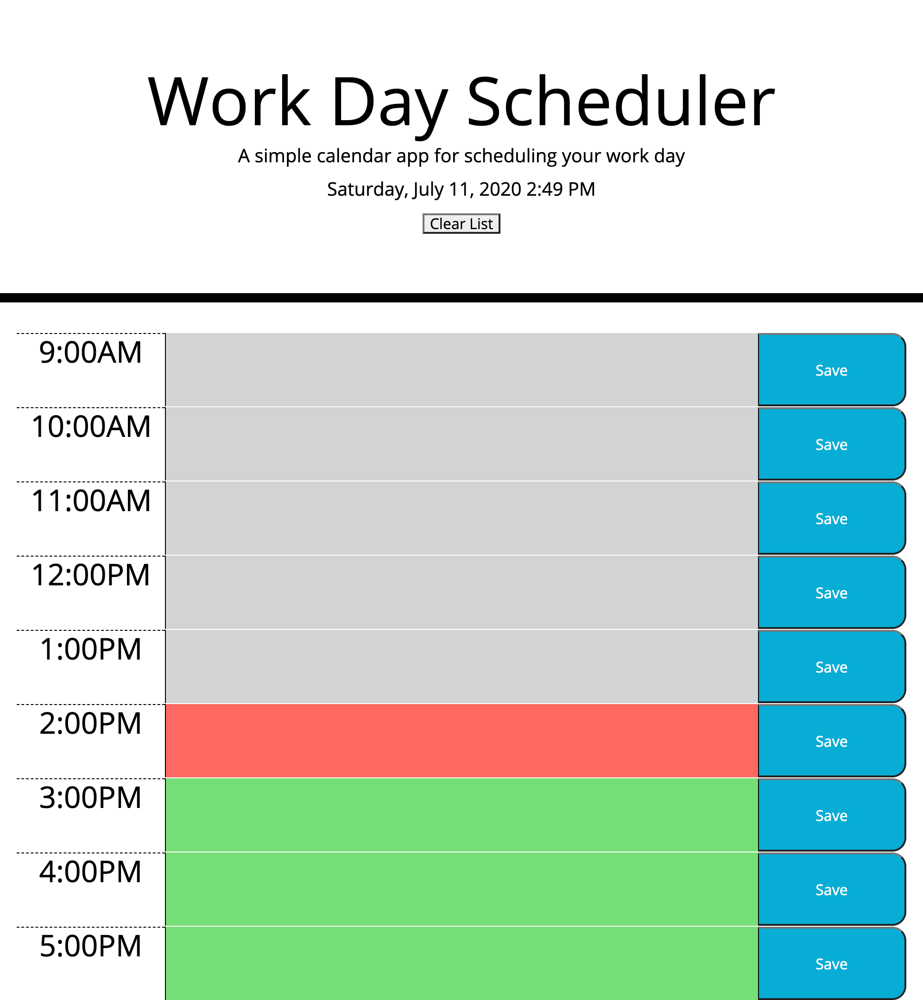

# day-schedule
About the project:

Work scheduler to organize time and events that are happening in a day.

Imager preview:

Description of project:

-Semantic HTML elements are used.

-CSS used for simple styling

-Structures are in logical structures in positioning and styling.

-Bootstrap grid system used for responsive layout.

-Javascript used

-Local strage is used for string.

Deployed Link:

https://juleeb.github.io/day-schedule/

